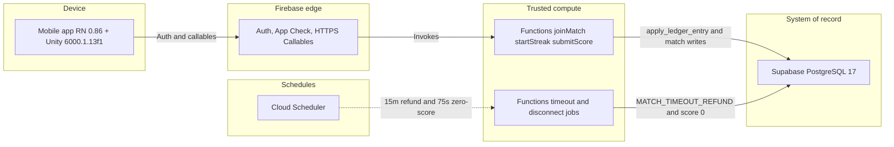
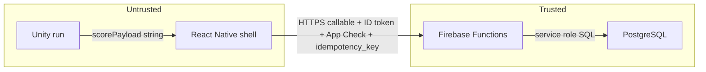

# System architecture

Trust and data flow for the real-money 1v1 basketball app. This is a planning diagram, not a deployment inventory. Unity is embedded in the React Native binary (not an independently shipped service); it is named here because it is a trust boundary.

Source of truth for pins: [`VERSION_MATRIX.md`](VERSION_MATRIX.md). Boundaries: [`BOUNDARIES.md`](BOUNDARIES.md). Decisions: [`../../DECISIONS.md`](../../DECISIONS.md).

## Runtime view

### How to read it

| Lane | What it is |
|---|---|
| Device | One iOS/Android app. RN hosts `UnityView`, generates `idempotency_key`, calls callables, renders balances. Unity only emits `scorePayload` over the in-process bridge (not shown as its own deployable). |
| Firebase edge | Identity, App Check, and the HTTPS front door. The phone never holds the Supabase service role. |
| Trusted compute | The only process allowed to mutate wallets, resolve matches, or accept scores. Callables are request/response; crons close abandoned runs. |
| PostgreSQL | Integer cents, append-only `ledger`, `apply_ledger_entry()` as the sole wallet writer. RLS deny-all for `anon` / `authenticated`. |

There is no arrow from the device to Postgres.

## Trust zones

## Money path

1. Client sends a mutation with a unique `idempotency_key`.
2. Functions verify Firebase ID token and App Check.
3. Functions `Math.floor` any multiplier to integer cents.
4. Functions call `apply_ledger_entry` (wallet row locked, ledger insert + balance update in one transaction).
5. Direct `UPDATE wallets` or `INSERT ledger` is rejected by trigger.

## Match clocks (not on the runtime diagram)

| Clock | Owner | Effect |
|---|---|---|
| ~60s run + one optional 5s buzzer-beater | Unity (untrusted claim) | Encoded in `scorePayload` |
| 75s score deadline | Postgres trigger + cron | No submit → score `0` |
| 15m open match | Postgres trigger + cron | No opponent → `MATCH_TIMEOUT_REFUND`, no auto-win |
